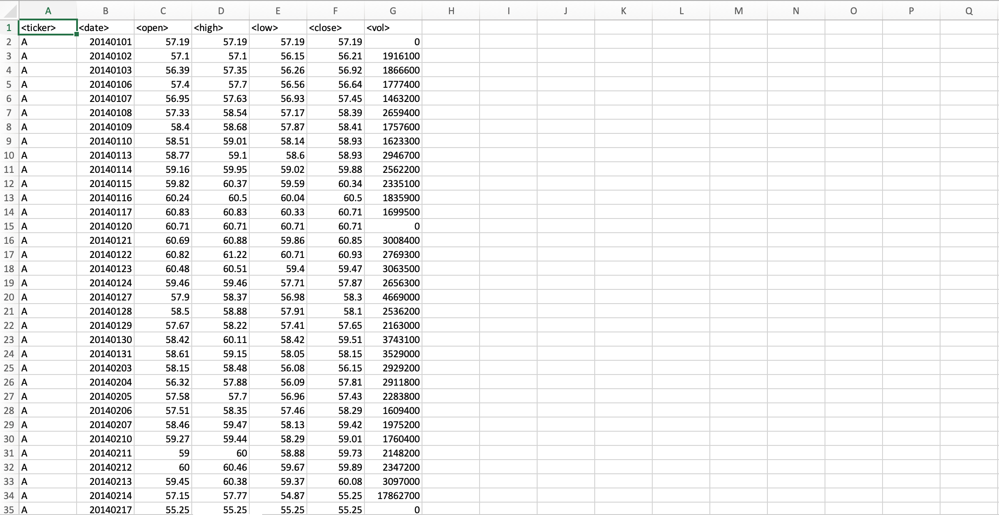
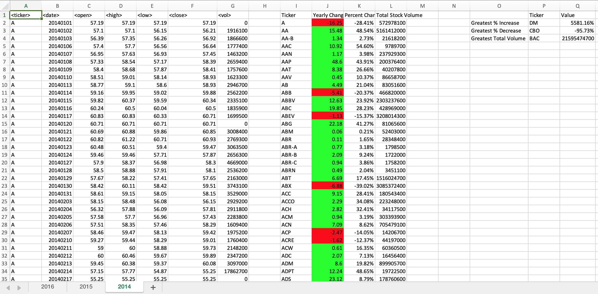

# Stock Analysis 

###### Description

In this assignment I used VBA scripting to analyze real stock market data from 2014, 2015 and 2016.

###### Data

Every year of real stock market data is represented on an individual Worksheet in an Excel file. Every sheet contains between 705,000 and 790,000 rows of stock data, each row containing < ticker >, < date > , < open >, < high > , < low >, < close > and < vol > information. 

###### Script

For every Excel Spreadsheet, the script looped though all the rows and created new columns displaying the results of the following calculations that were performed for each stock:
- Yearly change from what the stock opened the year at to what the closing price was.
- The percent change from the what it opened the year at to what it closed.
- The total Volume of the stock
- Ticker symbol

Conditional formatting was used to automatically highlight positive change in green and negative change in red. 

The script also located the stock with the "Greatest % increase", "Greatest % Decrease" and "Greatest total volume".
### Before VBA Script

### After VBA Script

