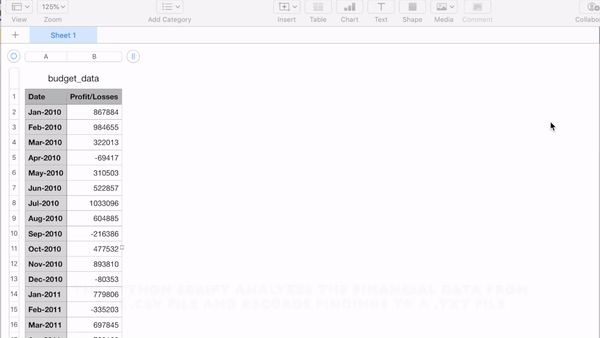

# Financial and Poll Data Analysis

###### Description

In this project I worked on two separate challenges that encompasses real-world situations. I wrote Python scripts that loaded csv files, stored contents to variables, lists and organized data in dictionaries to analyze financial records and poll data.  
1.	PyBank

I used Python to analyze financial records of a company and calculated each of the following:
- The total number of months included in the dataset
- The net total amount of "Profit/Losses" over the entire period
- The average of the changes in "Profit/Losses" over the entire period
- The greatest increase in profits (date and amount) over the entire period
- The greatest decrease in losses (date and amount) over the entire period

2.	PyPoll

I used Python to write a script that could help a small, rural town modernize its vote-counting process. Given a set of poll data, I created a Python script that analyzed the votes and calculated each of the following:
- The total number of votes cast
- A complete list of candidates who received votes
- The percentage of votes each candidate won
- The total number of votes each candidate won
- The winner of the election based on popular vote.

The findings and results were printed to the console as well as exported to a text file.
