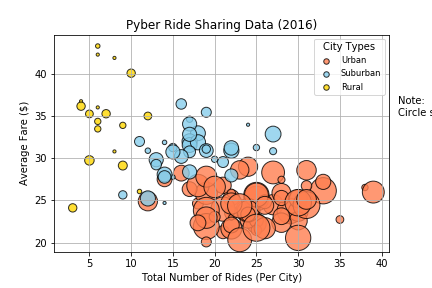
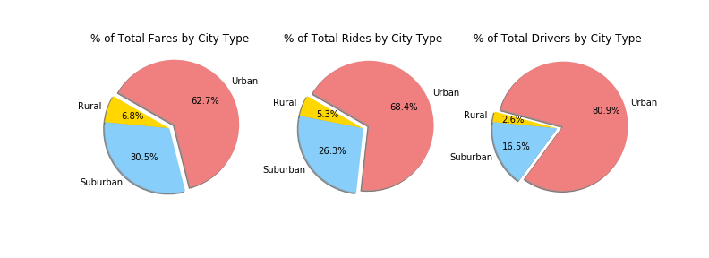

# PyBer - Building Vizualizations using Matplotlib

##### Description

In this assignment I used Jupyter Notebook, Matplotlib and Pandas Python library to build visualizations that offered data-backed guidance on new opportunities for market differentiation for a ride sharing company. 

##### Data
The data consists of a record of rides containing information about every active driver and historic ride, including details like city, driver count, individual fares, and city type.

##### Project

Data from different cities was merged with data containing information about rides offered in those cities to visualize where are the cities with the highest number of rides and create a comparison between rural, suburban and urban cities.

I build a Bubble Plot that showcased the relationship between four key variables:
- Average Fare ($) Per City
- Total Number of Rides Per City
- Total Number of Drivers Per City
- City Type (Urban, Suburban, Rural)

In addition, I generated the following three pie charts:
- % of Total Fares by City Type
- % of Total Rides by City Type
- % of Total Drivers by City Type

From combining and analyzing the data, the following conclusions were taken:
- The cities with the highest number of rides and divers are in the urban area.
- Urban cities also have a lower average fare than rural and sub-urban cities. 
- There is a strong correlation between the number of drivers in a city and the number of fares in that city.

Please see Jupyter notebook for code.
