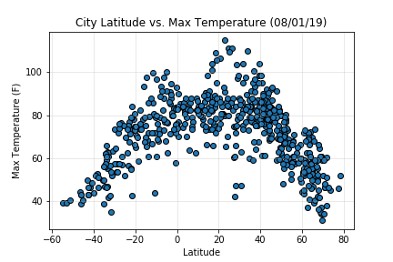
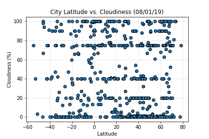
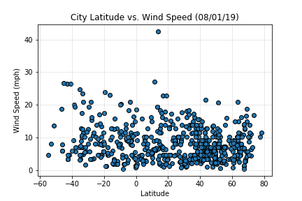

# What’s the Weather Like as We Approach the Equator?

##### Description

In this project I used Python requests, APIs, and JSON traversals to determine what the weather is like as we approach the equator; more exactly, I inspected how temperature, cloudiness and wind speed are affected by latitude. 

I used [cityPy](https://pypi.org/project/citipy/) library and the [OpenWeatherMap API](https://openweathermap.org/api) to retrieve data and create representative visualizations of weather across 500+ cities across the world of varying distance from the equator. 

##### Data

I wrote a Python script that uses [cityPy](https://pypi.org/project/citipy/) library to randomly select 500 unique (non-repeat) cities based on latitude and longitude. The program then performed a weather check on each of the cities using a series of successive API calls. After the data was retrieved and organized, the program automatically created a CSV file of all data retrieved.

I used Jupyter notebook to analyze the retrieved data and I used Matplotlib and Pandas plotting libraries to built a series of scatter plots to showcase the following relationships:
- Temperature (F) vs. Latitude
- Humidity (%) vs. Latitude
- Cloudiness (%) vs. Latitude
- Wind Speed (mph) vs. Latitude

##### Analysis Findings
As expected, the weather becomes significantly warmer as one approaches the equator (0 Deg. Latitude). More interestingly, however, is the fact that the southern hemisphere tends to be warmer this time of year than the northern hemisphere. 

There is no strong relationship between latitude and cloudiness. However, it is interesting to see that a strong band of cities sits at 0, 80, and 100% cloudiness.

There is no strong relationship between latitude and wind speed. However, in northern hemispheres there is a flurry of cities with over 20 mph of wind.

 

