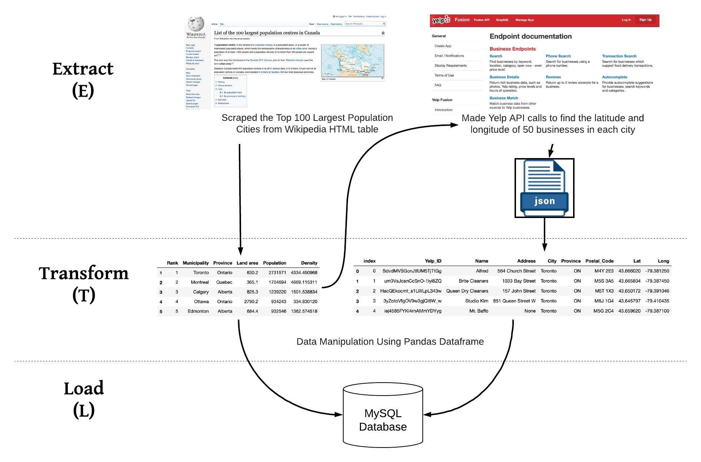

# Prospecting_Location_For_New_Business

This application helps businesses in the automotive and dry cleaning industries to visualize the denstity of similar businesses in Canada. It could potentially be used to help business owners choose a location for their new business in areas that are not saturated.

This project demostrates the ability to perform ETL (Extract Transform Load). The tools used were Jupyter Notebooks and different Python libraries such as requests, pandas, json, sqlalchemy.



Steps that were taken:
1. Extract:
  - Scraped Top 100 Largest Population Cities from [Wikipedia](https://en.wikipedia.org/wiki/List_of_the_100_largest_population_centres_in_Canada). ```pandas.read_html()``` function was used to scrape the table containing information about the cities.
  - For each city, the [Yelp API](https://www.yelp.com/developers/documentation/v3) was used and requests were made to find the latitude and longitude for 50 businesses in the city. ```requests``` python library was used to access the API and the ```json``` python library was used to read the api response.  


Our initial proposal is [here](https://docs.google.com/document/d/1eQVnBs8iHBTcIBRyi2aOYskhF_fh90I5vC6YzCPAb3Y/edit?usp=sharing).

2. Transformation:

  Web Scraping
  - For the web scraping of the Wikipedia, the table of interest was captured then the columns of the dataframe were renamed, the initial scrape returned numbers instead of column names.
Additionally, iloc was used on rows number 1 and above since the column names from the table in the web were all showing in row 0.
  - The next bit of cleanup involved dropping columns that had population totals per city for the previous years. The aim was to show the most current population totals.
  - In order to provide an additional set of data in a new column, the values in the columns “Land area(km2, 2011)” and "Population(2016)" were converted from string to numeric values. Those two columns came in with string values after our web scrape. With the values converted, the “Population_Density_km2” column was created by dividing the “Land area(km2, 2011)”into "Population(2016)" column.
  - With all the information now stored in a Panda dataframe, an SQL lite databased was created and the dataframe was converted into a table.

  API Calls
  - After completing API calls to YELP the responses were transformed into a Pandas dataframe. To create our Pandas dataframe  a dictionary was first created.
  - The Json file was explored to identify the location of the values needed.
  - Then the values for the dictionary were appended by looping through the json. 
  - Once the loop was finished the dictionary contained all the values needed. The dictionary was converted into a Pandas dataframe.
  - The dataframe was transformed into a table and stored in an SQL lite table.


3. Load:

  - For the load part of the project the data was prepared by getting it into Pandas dataframes; this made it simple to load each dataframe as a table in to a SQL lite database.
  - Given the nature of the data collected, the data was loaded into a structured database.  With this database, answers to queries can be obtained using simple SQL code. The two tables can potentially be joined to provide a more complete answers to future user’s queries. 

