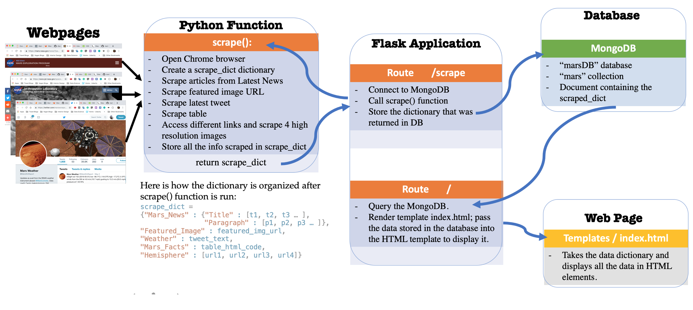
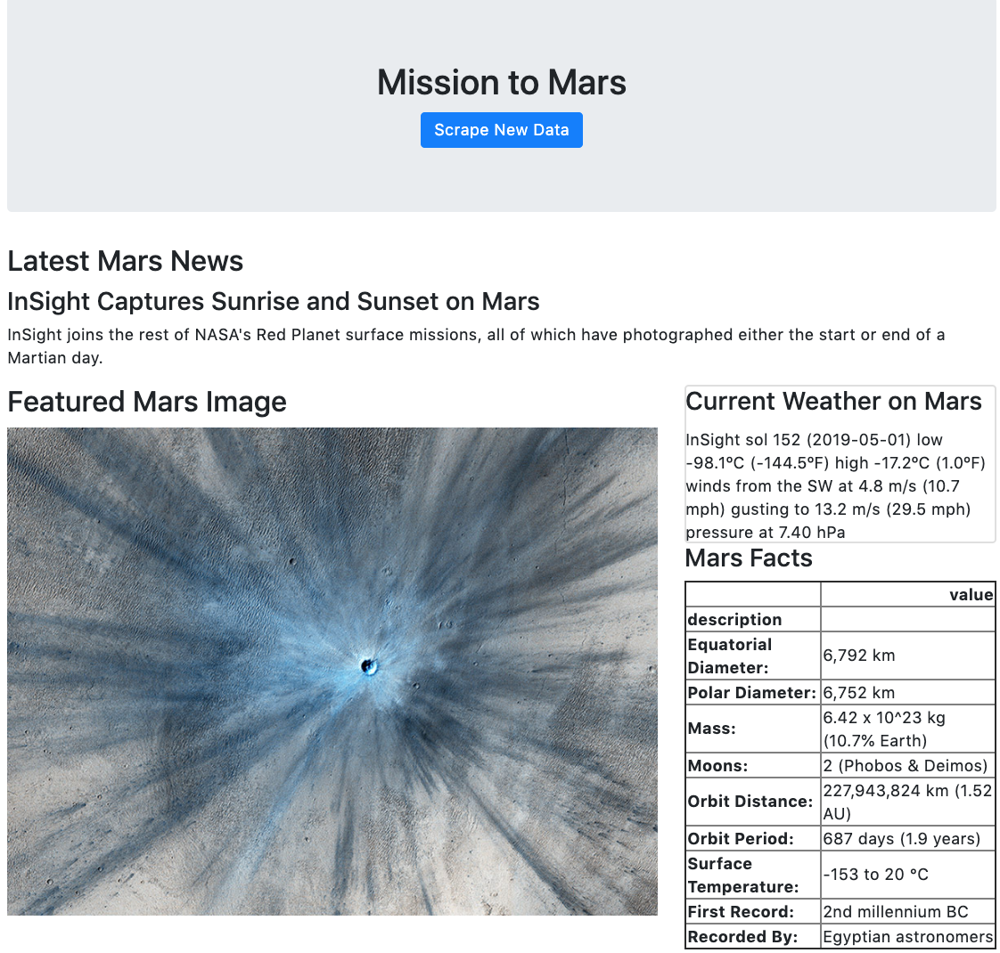

# Scrape-Store-Display-Mars
This project demonstrates the ability to scrape various websites for data, store the information found in a MongoDB and use Flask to display the information found on one HTML page.

Files:
* mars_app.py - contains the flask application
* scrape_mars.py - contains a function that scrapes data and returns it in a dictionary format
* template/index.html - contains the HTML file that includes code to display data in appropriate HTML elements
* template/scrape.html - contains the HTML file that includes a button that the user can press to scrape the data and store it in a database

Python Libraries Used:
* Flask, render_template, redirect, url_for
* pymongo 
* BeautifulSoup
* pandas
* requests
* splinter

Steps taken:
1. Scrape data
- Crate a  python function that scrapes the data and returns a dictionary containing the info scraped. Here are the steps for scraping the data. 
- Scraped the [NASA Mars News Site](https://mars.nasa.gov/news/?page=0&per_page=40&order=publish_date+desc%2Ccreated_at+desc&search=&category=19%2C165%2C184%2C204&blank_scope=Latest) for the latest news. 
- Scraped the featured image from [NASA Jet Propulsory Laboratory](https://www.jpl.nasa.gov/spaceimages/?search=&category=Mars) and saved the jpeg. image
- Scraped the latest tweet from the [Mars Weather twitter](https://twitter.com/marswxreport?lang=en) account 
- Scraped a [table](https://space-facts.com/mars/) containing facts about the planet Mars. 
- Followed a set of links and scraped high-resolution images from [USGS Astrogeology site](https://astrogeology.usgs.gov).

2. Store data in MongoDB and use Flask templating to display all the information scraped on an HTML page
- Create a root route <kbd>/scrape</kbd> that
    * Imports scrape_mars.py script and calls scrape() function.
    * Store the return value in Mongo as a Python dictionary.

- Create a root route <kbd>/</kbd> that
    * Checks to see if there is scraped information in the database.
    * If there is, it renders the index.html webpage that displays all the data in the appropriate HTML elements.
    * It there is not, it renders the scrape.html webpage and invides the user to scrape the information first.

This is how the final website looks like:

