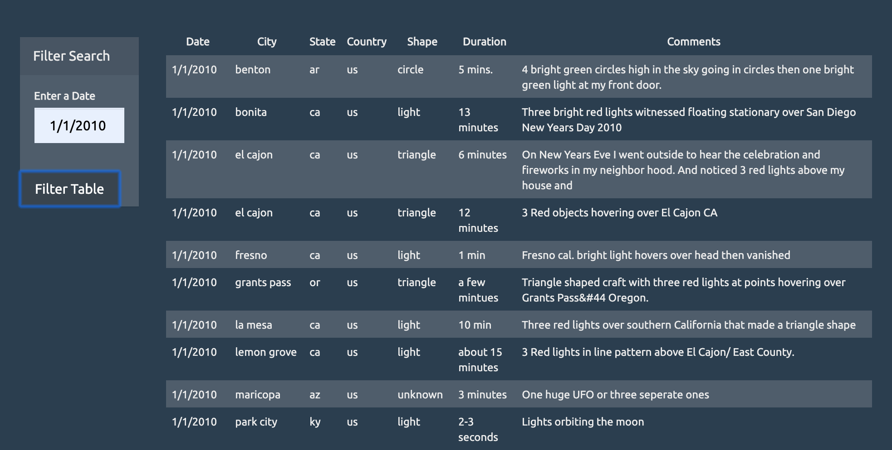

# JS_filter_UFO_data
In this project, I used JavaScript and D3 library to dynamically filter data and populate an HTML table with events on a specific date.

The purpose of the project is to make it easier for users to display eye-witness reports on a specific date. HTML, CSS, JavaScrips and D3.js were used to create and dynamically populate a table to display reports only on a date given by the user. 

This project demonstrates my ability to create dynamic websites using HTML, to style them using CSS and to use JavaScript to filter and display large collections of data by listening for events and searching through the date/time column to find rows that match the user input.

